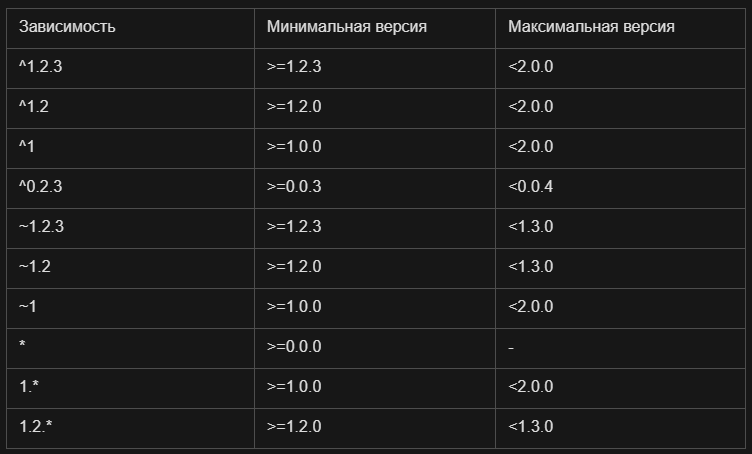

# venv

## Создание и активация виртуального окружения

Windows

`py -3.12 -m venv .my-venv # win`

`.venv\Scripts\activate.ps1`

Linux

`python3.12 -m venv .my-venv # linux`

`source .venv/bin/activate`

`deactivate`

# Менеджеры пакетов

# pip

`pip install requests numpy==1.26` - установить конкретную версию библиотеки

`pip list` - список установленных пакетов

`pip show numpy` - показать информацию о пакете

`pip list --outdated`

`pip freeze > requiremets.txt` - создать файл `requirements.txt`

`pip install -r requirements.txt` - устновить пакеты из файла

## poetry

### Установка и удаление пакетов

`poetry config --list` - список параметров конфигурации

`poetry config virtualenvs.in-project true` - включить создание виртуальной среды в папке проекта

`poetry init` - инициализация poetry в проекте

`poetry env info` - информация о среде

`poetry env use 3.12` - установка нужной версии python

#### Конфликты при установке

`requires-python = ">=3.10"` - изменить строку в `pyproject.toml`

`poetry add numpy==1.26`

`requires-python = ">=3.10, <=3.12.2"` - изменить строку в `pyproject.toml`

`poetry add numpy==1.26`

#### Пакетная установка библиотек

`poetry add pandas requests matplotlib`

#### Обновление библиотеки

`poetry remove numpy`

`requires-python = ">=3.12,<3.13"` - изменить строку в `pyproject.toml`

`poetry add numpy`

#### Понижение версии библиотеки

`poetry add pandas==2.3.0`

`poetry show --outdated`

`poetry show pandas`

`poetry add pandas@latest`

`poetry search pandas`

#### Дерево зависимостей

`poetry show --tree`

#### Группы зависимостей

`poetry add --dev scikit-learn@latest`

`poetry add -G test pytest`

`poetry add --test coverage`

#### Установка групп зависимостей

`poetry install --with test`

`poetry install --without dev`

`poetry install --only dev`

#### Экспорт среды

`poetry self add poetry-plugin-export` # linux

`pip install poetry-plugin-export` # win

`poetry export -f requirements.txt -o requirements.txt`

`poetry export -f requirements.txt -o requirements.txt --without-hashes`

#### Lock-файл

Это снимок точных версий всех зависимостей проекта + их хэши и маркеры окружения.
Нужен для:

* Повторяемых установок: у всех разработчиков/в CI ставятся те же самые версии.

* Безопасности: хэши защищают от подмены пакетов.

* Скорости: не надо заново решать граф зависимостей — берутся уже зафиксированные.

Когда он создаётся/обновляется автоматически

* poetry add ... — решает зависимости и записывает/обновляет poetry.lock.

* poetry install — если нет lock-файла, создаст; если есть — установит ровно то, что в нём.

`poetry lock`

`poetry lock --regenerate`

#### Переключение между окружениями

`poetry env use 3.10`

`poetry env list`

#### Проект как пакет

`poetry install --no-root`

или

```
[tool.poetry]
package-mode = false
```

##### Структура проекта

```
project_root/
  pyproject.toml
  src/
    miit_venv/
      __init__.py
      main.py
```

##### .toml file

```
[tool.poetry]
packages = [
  { include = "miit_venv", from = "src" }
]
```
`poetry install`

`from miit_venv.main import foo`

#### Запуск файлов

`poetry run plt_temp.py`

#### Указание зависимостей

